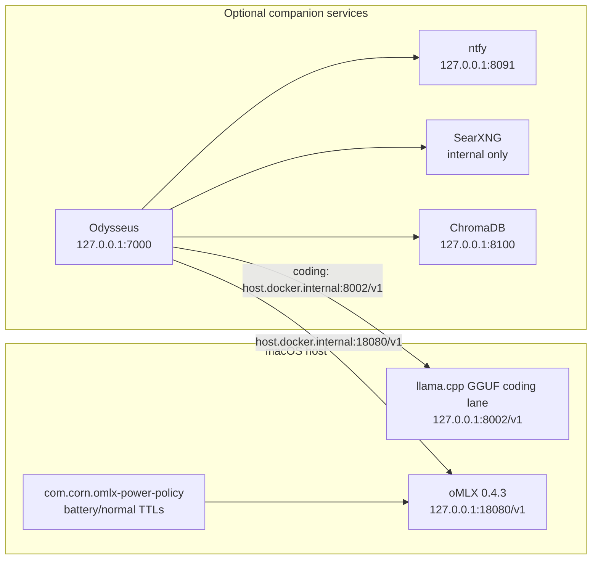

# macOS Wireless Auto-Switch

Automatically disable Wi-Fi when a wired or VLAN virtual connection is active, then restore Wi-Fi when all wired/VLAN links disconnect.

## What This Repo Contains

- `wireless.sh`: core detection and Wi-Fi toggle logic.
- `com.computernetworkbasics.wifionoff.plist`: launchd daemon that watches macOS network state.
- `install.sh`: install, update, and uninstall helper.
- `scripts/omlx-power-policy.sh`: host oMLX memory/battery policy for Gemma model TTLs and unload/load actions.
- `docs/`: wireless automation notes plus redirects for platform content that moved to Boneman_Projects.

## Supported Platforms

- macOS Sonoma (14.x)
- macOS Sequoia (15.x)
- macOS Tahoe (16.x)

## Quick Start

```bash
git clone https://github.com/locus313/macos-wireless-autoswitch.git
cd macos-wireless-autoswitch
./install.sh i
```

## Daily Commands

```bash
# install
./install.sh i

# update
./install.sh up

# uninstall
./install.sh ui

# menu mode
./install.sh
```

## Validate Installation

```bash
sudo launchctl list | grep com.computernetworkbasics.wifionoff
sudo /Library/Scripts/NetBasics/wireless.sh
networksetup -getairportpower Wi-Fi
```

## Troubleshooting

```bash
# restart daemon
sudo launchctl unload /Library/LaunchDaemons/com.computernetworkbasics.wifionoff.plist
sudo launchctl load /Library/LaunchDaemons/com.computernetworkbasics.wifionoff.plist

# list hardware ports
networksetup -listallhardwareports
```

## Fork Sync CI (Maintainers)

The fork sync workflow (`.github/workflows/fork-sync.yml`) runs every 30 minutes and is safe to trigger manually from the Actions tab.

- Checkout auth is not persisted globally.
- Push auth is scoped to `origin` only.
- Upstream fetch runs anonymously with retries to reduce intermittent credential prompt failures.
- Transient runner/network issues are tolerated so the next schedule can self-heal.

## Project Notes

- Uses hardware-port detection for Ethernet, LAN, Thunderbolt, AX88179A, and VLAN adapters.
- Includes VLAN virtual interfaces (for example `vlan10`) when deciding whether Wi-Fi should be disabled.
- Ignores loopback and self-assigned IP ranges when deciding wired status.
- Requires admin privileges for system-level network changes.
- Optional Odysseus/Gemma companion setup is documented in `docs/ODYSSEUS_GEMMA_DOCKER.md`.
- oMLX memory and battery policy is documented in `docs/OMLX_POWER_POLICY.md`.
- The measured GGUF/llama.cpp coding lane is managed by `scripts/gemma4-gguf-coding-lane.sh` on `127.0.0.1:8002`.
- AdGuard LocalDNSCrypt is documented in `docs/network/adguard-dnscrypt-setup.md`.
- GitHub-star modernization decisions are documented in `docs/autonomous-modernization/11-github-stars-full-implementation.md`.
- Approved GitHub-star trial helpers are documented in `docs/star-tools/approved-star-trials.md`.
- Unified local-AI platform architecture is documented in `docs/autonomous-modernization/16-unified-ai-platform-architecture.md`.
- Daily platform status can be checked with `scripts/star-tools/platform-status.sh`.
- Weekly AI repository review records are canonical in `/Users/corn/Documents/Boneman_Projects/docs/ai-trending-repos/`.

## Local AI Companion Architecture



The canonical cross-repo local AI map is maintained in `/Users/corn/Documents/Boneman_Projects/local-ai-platform/ARCHITECTURE.md`.

Repository-governance and platform migration records are canonical in
[`Boneman_Projects`](https://github.com/Thetromboneman1/Boneman_Projects/tree/main/docs/repository-governance).

The repo-local integration map for the GitHub-star platform layer is maintained in `docs/architecture/`, with the operational runbook at `docs/operations/platform-runbook.md`.

Codex, VS Code, and shared skill integration is documented in `docs/autonomous-modernization/25-skills-installation-and-integration.md` and `docs/skills/`.

## License

MIT. See `LICENSE`.
