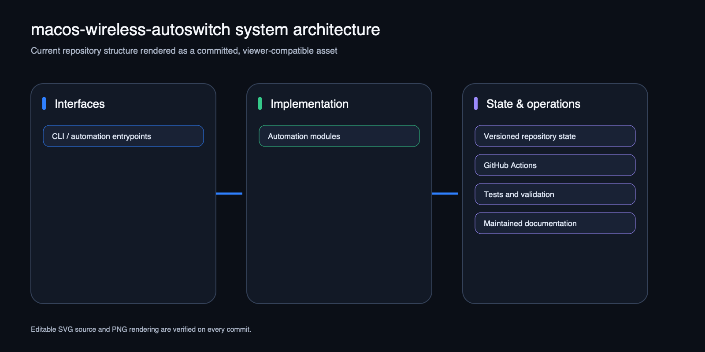

# macOS Wireless Auto-Switch

> Local AI note, 2026-08-18: Qwen3.6/Rapid-MLX is retired. Canonical model
> routing remains in Boneman_Projects with four oMLX Gemma roles and Qwen3.8
> stock/uncensored Q6_K selectors.
> Colibri is also retired and deleted. Ports `8010`, `8020`, `18010`, and
> `18020` must stay closed.

Local image generation is owned by Boneman_Projects. Its FLUX.2 Klein 4B Q8
gateway stays available on `127.0.0.1:18081`, loads weights only for a request,
and unloads them after 300 idle seconds without using Codex allowance or
`OPENAI_API_KEY`.

Automatically disable Wi-Fi when an enabled physical wired connection is active,
then restore Wi-Fi when physical wired links disconnect. Tagged VLAN and other
virtual network adapters are deliberately ignored.

## What This Repo Contains

- `wireless.sh`: core detection and Wi-Fi toggle logic.
- `com.computernetworkbasics.wifionoff.plist`: launchd daemon that watches macOS network state.
- `install.sh`: install, update, and uninstall helper.
- `docs/`: wireless automation notes plus small compatibility redirects for platform content now owned by Boneman_Projects.

## Supported Platforms

- macOS Sonoma (14.x)
- macOS Sequoia (15.x)
- macOS Tahoe (16.x)
- macOS Golden Gate (current Darwin 27 release)
- Later macOS releases use runtime discovery with a compatibility warning

## Quick Start

```bash
git clone https://github.com/locus313/macos-wireless-autoswitch.git
cd macos-wireless-autoswitch
./install.sh i
```

## Daily Commands

```bash
# install
./install.sh i

# update
./install.sh up

# uninstall
./install.sh ui

# menu mode
./install.sh
```

## Validate Installation

```bash
sudo launchctl list | grep com.computernetworkbasics.wifionoff
sudo /Library/Scripts/NetBasics/wireless.sh
/bin/bash -c 'source /Library/Scripts/NetBasics/wireless.sh; for wifi_device in $(get_wifi_interfaces); do /usr/sbin/networksetup -getairportpower "$wifi_device"; done'
sudo launchctl print system/com.computernetworkbasics.wifionoff
tail -50 /var/log/wireless-autoswitch.log
```

## Troubleshooting

```bash
# restart daemon
sudo launchctl unload /Library/LaunchDaemons/com.computernetworkbasics.wifionoff.plist
sudo launchctl load /Library/LaunchDaemons/com.computernetworkbasics.wifionoff.plist

# list hardware ports
networksetup -listallhardwareports

# confirm current routes and interface service order
route -n get default
networksetup -listnetworkserviceorder
```

## Fork Sync CI (Maintainers)

The fork sync workflow (`.github/workflows/fork-sync.yml`) runs every 30 minutes and is safe to trigger manually from the Actions tab.

- Checkout auth is not persisted globally.
- Push auth is scoped to `origin` only.
- Upstream fetch runs anonymously with retries to reduce intermittent credential prompt failures.
- Transient runner/network issues are tolerated so the next schedule can self-heal.

## Project Notes

- Intersects enabled services with real hardware-port records, then classifies
  them by live macOS driver type. It does not depend on a dock name, service
  name, vendor, or `en` number.
- Deliberately excludes tagged VLAN and bridge virtual interfaces from dock detection.
- Ignores loopback and self-assigned IP ranges when deciding wired status.
- Uses a short driver-publication grace window plus a bounded DHCP settle window
  so late or renamed dock adapters do not leave Wi-Fi in the wrong state.
- Runs at login/startup, reacts to network configuration changes, and performs a
  60-second reconciliation pass to recover from missed dock or wake events.
- Changes only Wi-Fi radio power. It does not modify DNS servers, search domains,
  AdGuard, Control D, or other resolver settings.
- Requires admin privileges for system-level network changes.
- The current AdGuard + Control D setup is documented in `docs/network/adguard-controld-setup.md`.
- Local AI, model residency, platform governance, agent-platform, Apple Container pilot, and AI tooling docs are canonical in `/Users/corn/Documents/Boneman_Projects` and `https://github.com/Thetromboneman1/Boneman_Projects`.

## License

MIT. See `LICENSE`.

## Spec Kit Development Workflow

GitHub Spec Kit `v0.12.15` is initialized in this repository for
specification-driven wireless automation changes. Use `.specify/` for shared
workflow artifacts, `.agents/skills/speckit-*` with Codex,
`.opencode/commands/` with OpenCode, and `.goose/recipes/` with Goose.

```bash
specify version
specify integration status --json
```

`AGENTS.md` remains authoritative: this repository owns wireless automation
only, while fleet-wide Spec Kit governance and repair commands stay in
[Boneman_Projects](https://github.com/Thetromboneman1/Boneman_Projects).

<!-- documentation-health:start -->

## Current repository state



- **Default branch:** `main`
- **Implementation fingerprint:** `3cf33859cbb64ed4`
- **Detected structure:** Automation modules, GitHub Actions, Tests and validation, Maintained documentation.
- **Documentation contract:** editable diagram sources, committed PNG renderings,
  resolved local image links, and generated state are checked on every commit.
- **Refresh command:** `python3 scripts/documentation_health.py --write`

See [repository state](docs/REPOSITORY_STATE.md) and the
[architecture asset guide](docs/architecture/README.md).
<!-- documentation-health:end -->
