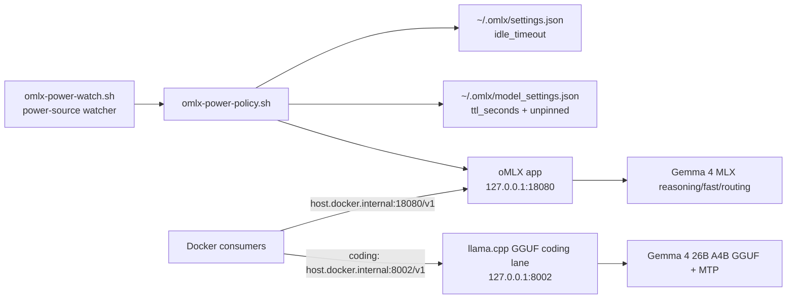

# oMLX Power Policy

This repo keeps model serving outside Docker so Apple Silicon can use Metal directly. oMLX `0.4.3` remains the host runtime for primary reasoning, fast, and routing roles. The coding role can use the measured host-side llama.cpp GGUF/MTP lane on `127.0.0.1:8002`; use `scripts/omlx-power-policy.sh` to manage only the oMLX-resident models.

## Architecture



## Model Roles

| Role | Model ID | Normal TTL | Battery/conserve TTL |
| --- | --- | ---: | ---: |
| Primary reasoning | `mlx-community--gemma-4-31b-it-4bit` | 20 min | 10 min |
| Coding/workhorse | `gemma-4-26B-A4B-it-UD-Q4_K_XL.gguf` via llama.cpp GGUF/MTP | managed by `scripts/gemma4-gguf-coding-lane.sh` | stop lane when conserving |
| Fast agent | `mlx-community--gemma-4-e4b-it-4bit` | 60 min | 20 min |
| Routing/utility | `mlx-community--gemma-4-e2b-it-4bit` | 60 min | 30 min |

The oMLX role models are explicitly unpinned by the policy. The coding GGUF lane is a separate llama.cpp process and is not controlled by oMLX TTLs.

## Commands

```bash
# Show loaded-count, memory ceiling, and persisted TTL/pinning policy
scripts/omlx-power-policy.sh status

# Balanced daily policy for plugged-in use
scripts/omlx-power-policy.sh normal

# Shorter TTLs and immediate unload of the 31B/26B models
scripts/omlx-power-policy.sh conserve

# Same policy as conserve; intended for battery or thermal pressure
scripts/omlx-power-policy.sh battery

# Immediate manual controls
scripts/omlx-power-policy.sh unload-large
scripts/omlx-power-policy.sh unload-all
scripts/omlx-power-policy.sh load-fast
```

The script reads the local oMLX API key from `~/.omlx/settings.json` when it needs to call authenticated endpoints. It does not print the key or write it into this repository.

## Automatic Battery Switching

Install the user LaunchAgent to switch policies when macOS changes power source:

```bash
mkdir -p ~/.omlx/bin ~/.omlx/logs ~/Library/LaunchAgents
cp scripts/omlx-power-policy.sh ~/.omlx/bin/omlx-power-policy.sh
cp scripts/omlx-power-watch.sh ~/.omlx/bin/omlx-power-watch.sh
chmod +x ~/.omlx/bin/omlx-power-policy.sh ~/.omlx/bin/omlx-power-watch.sh
cp launchd/com.corn.omlx-power-policy.plist ~/Library/LaunchAgents/
launchctl bootstrap "gui/$(id -u)" ~/Library/LaunchAgents/com.corn.omlx-power-policy.plist
launchctl enable "gui/$(id -u)/com.corn.omlx-power-policy"
launchctl kickstart -k "gui/$(id -u)/com.corn.omlx-power-policy"
```

The watcher runs `scripts/omlx-power-policy.sh normal` on AC power and `scripts/omlx-power-policy.sh battery` on battery. It stores the last applied state in `~/.omlx/power-policy-state` so it only restarts oMLX on power-source transitions.

Uninstall:

```bash
launchctl bootout "gui/$(id -u)" ~/Library/LaunchAgents/com.corn.omlx-power-policy.plist
rm -f ~/Library/LaunchAgents/com.corn.omlx-power-policy.plist
```

## What The Script Changes

- `~/.omlx/settings.json`: sets `idle_timeout.idle_timeout_seconds`.
- `~/.omlx/model_settings.json`: sets `ttl_seconds` and `is_pinned: false` for the four Gemma role models.
- oMLX app runtime: restarts oMLX by default so persisted settings are loaded.
- In conserve and battery modes: asks oMLX to unload the 31B and 26B models immediately after restart.
- `scripts/omlx-power-watch.sh`: optionally runs as a user LaunchAgent and applies `normal` or `battery` only when the power source changes.

Current live audit command:

```bash
scripts/omlx-power-policy.sh status
launchctl print "gui/$(id -u)/com.corn.omlx-power-policy" | sed -n '1,60p'
```

Set `OMLX_RESTART=0` to only write settings without restarting oMLX:

```bash
OMLX_RESTART=0 scripts/omlx-power-policy.sh normal
```

## Recommended Operating Pattern

- Use `normal` when plugged in and actively using local AI.
- Use `battery` when unplugging, when the machine is hot, or before travel.
- Use the LaunchAgent when you want automatic switching between those two modes.
- Use `load-fast` when you want quick small-agent startup without loading the 31B/26B models.
- Use `status` after policy changes to confirm `loaded_count` and current model memory.
