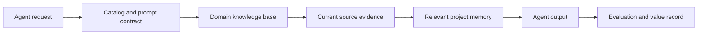

# Agent Memory Architecture

Date: 2026-06-23
Owner: AI Workforce Program

## Purpose

The memory architecture defines how operational agents retain useful context without storing secrets, creating uncontrolled personal data stores, or drifting from current source evidence.

## Memory Types

| Memory type | Purpose | Storage | Retention |
|---|---|---|---|
| Short-term memory | Preserve context within a single run | Conversation context and attached evidence | Run duration only |
| Project memory | Reuse stable project decisions and local runtime constraints | Repo docs, promoted memory notes, agent run records | Review monthly or after platform changes |
| Knowledge memory | Retrieve domain standards, examples, and runbooks | `docs/knowledge/`, indexed docs, selected repos | Refresh on domain cadence |
| Evaluation memory | Track output quality and regression patterns | Sanitized evaluation records | Keep with reporting cycle |
| Business value memory | Track time saved, opportunities, ROI, and delivery outcomes | Business value log or report artifact | Quarterly review |

## Retrieval Architecture

## Memory Rules

- Current source evidence overrides memory.
- Memory-derived facts must be labeled when not verified in the current run.
- Secrets, token prefixes, cookies, private keys, and raw credential files are never stored in agent memory.
- Boneman item names and retrieval methods may be documented; secret values may not.
- Retired or superseded facts must be removed from retrieval indexes or marked superseded.

## Agent Memory Use

| Agent | Memory priority |
|---|---|
| Enterprise Architecture Copilot | Project decisions, TAP Lite examples, governance constraints |
| AAP Platform Copilot | Automation standards, reviewed playbook patterns, ROI assumptions |
| Satellite Platform Copilot | Lifecycle policy, content-view patterns, compliance exceptions |
| Server Engineering Copilot | Runbook lessons, incident patterns, rollback procedures |
| Executive Communications Copilot | Audience preferences, reporting cadence, prior decision asks |
| Automation Discovery Copilot | Candidate backlog, scoring assumptions, owner history |
| Operational Review Copilot | KPI trends, drift findings, capacity and DR results |

## Validation

Memory architecture is valid when each agent can identify which memory type it used, cite current evidence, label stale or unverified memory, and avoid storing restricted data.
