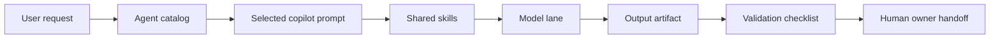

# Agent Runtime Architecture

Date: 2026-06-23
Owner: AI Workforce Program

## Purpose

This runtime architecture integrates the enterprise agent portfolio into the existing AI platform without building new platform plumbing. The agents are reusable prompt contracts and operating workflows that run through Codex, VS Code, Hermes, OpenCode, and the shared skills library.

## Runtime Principles

- Preserve oMLX at `http://127.0.0.1:18080/v1` as the production OpenAI-compatible front door.
- Preserve the Gemma role contract: 31B reasoning, 26B A4B coding, E4B fast agent, E2B routing/utility.
- Use llama.cpp at `http://127.0.0.1:8002/v1` only for measured GGUF coding or reliability-lane work.
- Keep Rapid-MLX at `http://127.0.0.1:8010/v1` as a manual lab lane.
- Do not default to Ollama.
- Store secrets in Boneman and document pointers, not values.
- Use agents for business output, not additional runtime abstraction.

## Agent Invocation Flow

## Model Lane Mapping

| Work type | Default lane | Model |
|---|---|---|
| Architecture, risk, governance, RCA, quarterly synthesis | oMLX reasoning | `mlx-community--gemma-4-31b-it-4bit` |
| Playbook review, runbook drafting, repo edits, docs | oMLX coding | `mlx-community--gemma-4-26b-a4b-it-4bit` |
| Short summaries and operator updates | oMLX fast-agent | `mlx-community--gemma-4-e4b-it-4bit` |
| Classification and routing | oMLX routing utility | `mlx-community--gemma-4-e2b-it-4bit` |
| GGUF coding/reliability comparison | llama.cpp | `gemma-4-26B-A4B-it-UD-Q4_K_XL.gguf` |
| Experimental tool-call trials | Rapid-MLX | `qwen3.6-35b-4bit` |

## Integration Surfaces

| Surface | Runtime use |
|---|---|
| Codex | Primary implementation, repo review, sample runs, docs generation, validation, and commits. |
| VS Code | Prompt-driven selected-text workflows through `.github/prompts/enterprise-agent-workforce.prompt.md`. |
| OpenCode | Interactive coding, playbook review, and engineering refinement using local providers. |
| Hermes | Reusable guided workflows for platform owners and executive/operational review. |
| Goose | Operator-facing agent client for stable workflows after prompt validation. |
| OpenClaw | Broader agent workbench for approved workflows with Boneman-backed secrets. |
| Shared skills library | Domain routing through `enterprise-automation`, `documentation`, `devops`, `security`, and `local-ai`. |

## Agent-to-Skill Routing

| Agent | Primary skills | Secondary skills |
|---|---|---|
| Enterprise Architecture Copilot | `documentation`, `enterprise-automation` | `security`, `local-ai` |
| AAP Platform Copilot | `enterprise-automation` | `devops`, `security`, `documentation` |
| Satellite Platform Copilot | `enterprise-automation` | `devops`, `security`, `documentation` |
| Server Engineering Copilot | `devops` | `enterprise-automation`, `security`, `documentation` |
| Executive Communications Copilot | `documentation` | All domain skills as source validators |
| Automation Discovery Copilot | `enterprise-automation` | `documentation`, `devops` |
| Operational Review Copilot | `devops`, `documentation`, `local-ai` | `security`, `enterprise-automation` |

## Reuse Pattern

1. Select the agent from `docs/agents/agent-catalog.md`.
2. Use the agent-specific prompt contract.
3. Attach the smallest useful source context.
4. Select the model lane from the mapping above.
5. Generate the output artifact.
6. Run the agent validation checklist.
7. Hand off to the documented owner.

## Operational Workflow

| Cadence | Agent | Output |
|---|---|---|
| Daily or ad hoc | Server Engineering Copilot | Troubleshooting plans, runbooks, incident summaries. |
| Weekly | Automation Discovery Copilot and AAP Platform Copilot | Candidate backlog, playbook reviews, automation ROI notes. |
| Monthly | Satellite Platform Copilot and Operational Review Copilot | Patch/lifecycle review and operational health review. |
| Quarterly | Enterprise Architecture, Executive Communications, Operational Review | TAP Lite packages, quarterly review, executive summary. |

## Validation Requirements

For every agent run:

- prompt quality: the role, audience, task, rules, and output schema are present;
- output quality: the output is directly usable by its target owner;
- documentation quality: the output cites or names evidence and identifies missing evidence;
- integration path: runtime surface and model lane are recorded when relevant;
- operational workflow: owner, next action, validation, and review cadence are clear.

## Change Control

Agent prompt contracts are documentation-controlled artifacts. Update them through normal repo review. Do not add new always-on services, routers, or provider defaults without benchmark evidence and governance approval.
