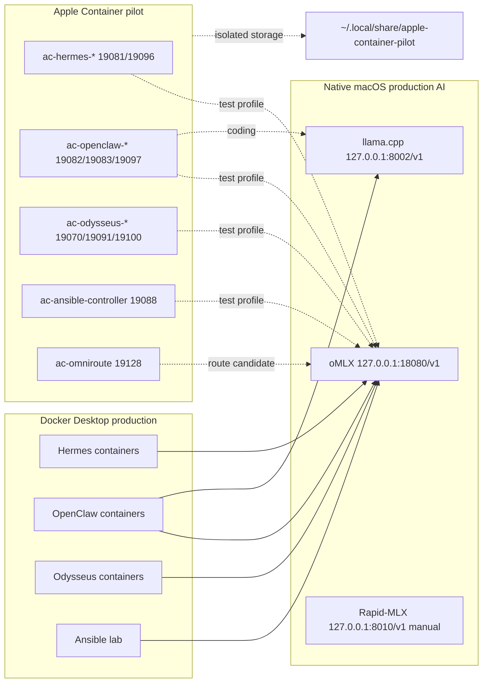

# Apple Container Side-By-Side Architecture

Date: 2026-06-23

The pilot is a separate test lane. It must not bind production ports, write production volumes, replace host oMLX, or alter default Codex/Hermes/OpenCode/Goose profiles.
