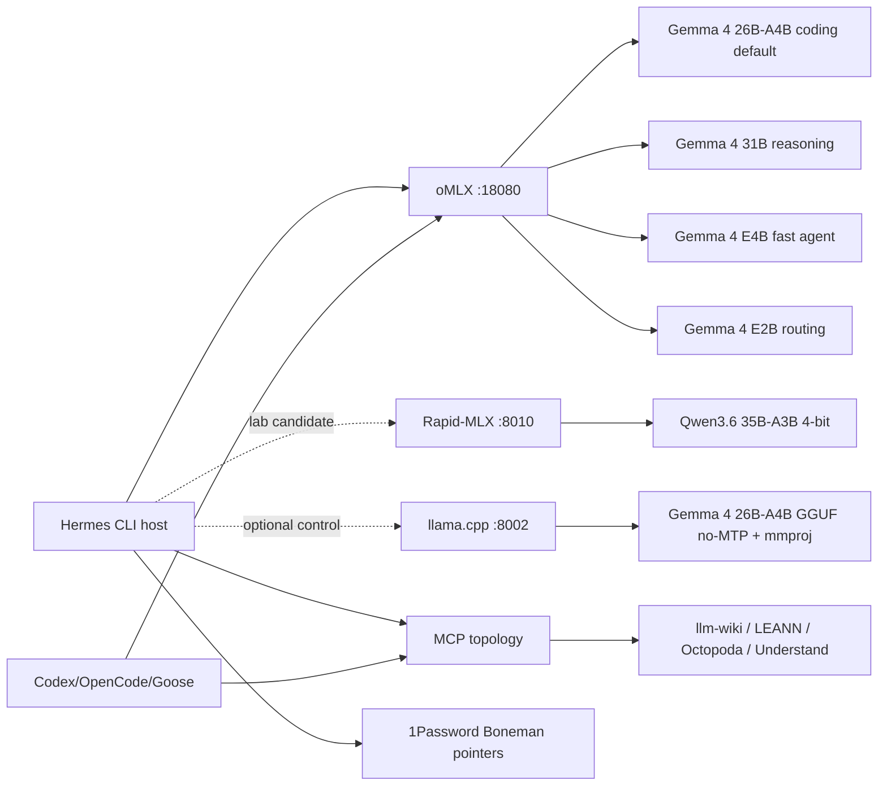

# Hermes MLX Local AI Architecture

Date: 2026-06-22

## Runtime Boundaries

- Host automation uses `http://127.0.0.1:18080/v1`.
- Docker consumers use `http://host.docker.internal:18080/v1`.
- Rapid-MLX is a lab endpoint on `http://127.0.0.1:8010/v1`, started only when needed.
- llama.cpp is an optional no-MTP GGUF lane on `http://127.0.0.1:8002/v1`.

## Default Path

Hermes defaults to oMLX with `mlx-community--gemma-4-26b-a4b-it-4bit` because it passed model listing, chat completion, and structured tool-call validation with low latency and without the memory warning seen on the larger Rapid-MLX Qwen lane.

## Candidate Path

Rapid-MLX with `qwen3.6-35b-4bit` is the strongest Hermes orchestration candidate to continue testing. It advertises text/tools capability, uses the Qwen tool parser, and won the measured 2-way concurrency pass, but should not autostart until memory headroom is consistently comfortable.
