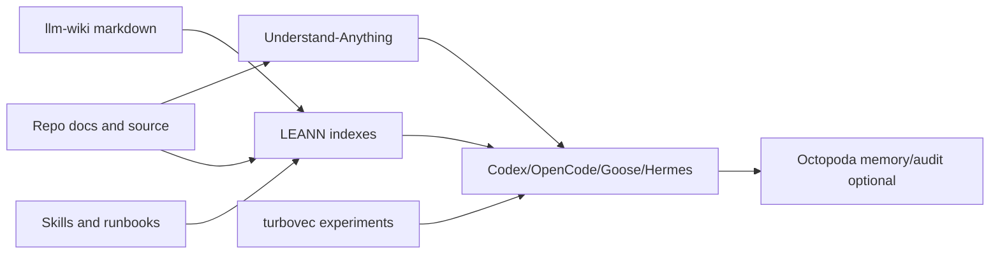

# Knowledge Layer

Date: 2026-06-22

## Goal

Create a shared retrieval layer for repo docs, local-AI knowledge, skills, and codebase structure without locking the platform into one index format.

## Components

| Component | Role | Status |
|---|---|---|
| llm-wiki | Curated local AI knowledge base and Codex/OpenCode reference corpus. | Downloaded and wired to Codex/OpenCode. |
| LEANN | Private local RAG and MCP retrieval. | Installed as `leann` and `leann_mcp`. |
| turbovec | Lightweight vector search library for local RAG experiments. | Installed in isolated uv env. |
| Understand-Anything | Repo graph, onboarding, explanation, dashboard, and skills. | Installed and skill-linked. |
| Octopoda | Agent memory, audit trail, and dashboard. | Installed; stopped by default. |

## Architecture



## Ingestion Policy

- Index explicit roots only.
- Do not index `.env`, keychains, browser profiles, 1Password exports, raw tokens, or private model caches unless a separate approval exists.
- Start with docs and selected repos, then expand when query quality justifies the index cost.
- Record index roots, timestamps, and ignored patterns in the run log for each indexing job.

## Retrieval Policy

| Workload | Preferred source |
|---|---|
| Local AI docs and model-serving patterns | llm-wiki plus repo docs |
| Repo onboarding/explanation | Understand-Anything |
| Semantic code/docs retrieval | LEANN |
| Vector search implementation experiments | turbovec |
| Agent memory/audit | Octopoda |

## Initial Index Plan

1. Index `docs/` and `README.md` from this repo with LEANN.
2. Add `tmp/star-downloads/nvk__llm-wiki` as a separate corpus.
3. Use Understand-Anything for interactive graph exploration of the active repo.
4. Compare LEANN retrieval with a small turbovec prototype before adding more repos.

## Validation

```bash
command -v leann
command -v leann_mcp
scripts/star-tools/validate-star-deployments.sh
scripts/star-tools/start-understand-dashboard.sh
```

The dashboard/start commands are intentional, interactive operations. They are not LaunchAgents.
