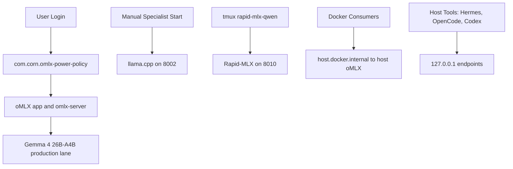

# Local AI Startup Architecture

Date: 2026-06-23

## Startup Rules

- oMLX power policy may start at login.
- llama.cpp remains a manual specialist lane.
- Rapid-MLX is currently expected to stay running in `tmux` session `rapid-mlx-qwen` as an available specialist lane; stop it only for documented memory pressure or rollback.
- `com.corn.vllm-mlx` is archived and no longer part of active startup.
- Host tools use `127.0.0.1`.
- Docker consumers use `host.docker.internal`.

## Current Ports

| Port | Lane | Current state |
|---:|---|---|
| 18080 | oMLX production | listening |
| 8002 | llama.cpp GGUF specialist | listening |
| 8010 | Rapid-MLX Qwen3.6 specialist | listening |

For the current startup policy, use [startup-orchestration-v2.md](startup-orchestration-v2.md).
