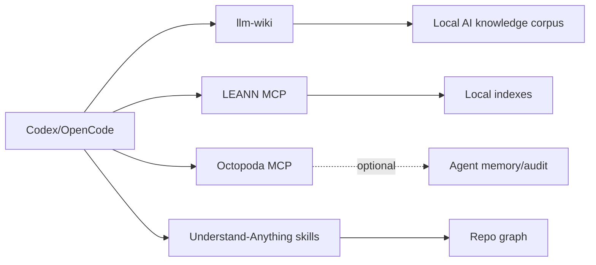

# MCP Topology

Date: 2026-06-22

## Purpose

This topology lets Codex, OpenCode, Goose, Hermes, OpenClaw, and OpenHands share local knowledge, retrieval, and agent tools without scattering one-off MCP servers across configs.

Machine-readable source: `config/local-ai-platform/mcp-topology.json`.

## Clients

| Client | Role | Current integration |
|---|---|---|
| Codex | Primary autonomous maintainer | `~/.codex/config.toml` includes local llm-wiki marketplace/plugin config. |
| OpenCode | Local coding shell | `~/.config/opencode/opencode.json` includes llm-wiki instruction path and local model providers. |
| Goose | Agent client | Installed; should consume the same endpoint and knowledge policies before direct config edits. |
| Hermes | Agent/workbench | Installed; keep cloud/local fallback and avoid unrelated repo edits. |
| OpenClaw | Agent/workbench | Installed; gateway token lives in `Boneman`. |
| OpenHands | Sandbox agent workbench | Docker image installed; start explicitly with a workspace mount. |

## Servers And Tool Surfaces

| Server/surface | Command or source | Status | Boundary |
|---|---|---|---|
| llm-wiki | `tmp/star-downloads/nvk__llm-wiki` | Wired to Codex/OpenCode | Local docs/knowledge only. |
| LEANN MCP | `leann_mcp` | Installed | Indexing is explicit; provider secrets from `Boneman` only. |
| Octopoda MCP | `octopoda-mcp` | Installed | Start per experiment; local audit/memory state. |
| Understand-Anything | `~/.agents/skills/understand*` symlinks | Wired as skills | Repo analysis/indexing should be scoped to intended workspaces. |
| OmniRoute | `scripts/star-tools/start-omniroute-local.sh` | Installed, stopped | Provider routing and API keys; lab only. |
| headroom | `scripts/star-tools/start-headroom-proxy.sh` | Installed, stopped | Proxy/compression; lab only. |

## Recommended Flow



## Wiring Policy

- Prefer stdio MCP for local tools unless the tool requires a dashboard or shared HTTP state.
- Use explicit project/workspace roots for indexing and agent actions.
- Keep `OmniRoute`, `headroom`, and `OpenHands` out of default MCP startup because they can proxy credentials or access broad filesystem surfaces.
- Store all provider tokens in `Boneman`; pass them via environment at runtime.
- Hermes host CLI uses the local oMLX endpoint directly; Dockerized Hermes surfaces should keep the Docker host boundary.

## Validation

```bash
command -v leann_mcp
command -v octopoda-mcp
test -L ~/.agents/skills/understand
grep -F 'wiki@llm-wiki' ~/.codex/config.toml
grep -F 'llm-wiki-opencode/skills/wiki-manager/SKILL.md' ~/.config/opencode/opencode.json
```
