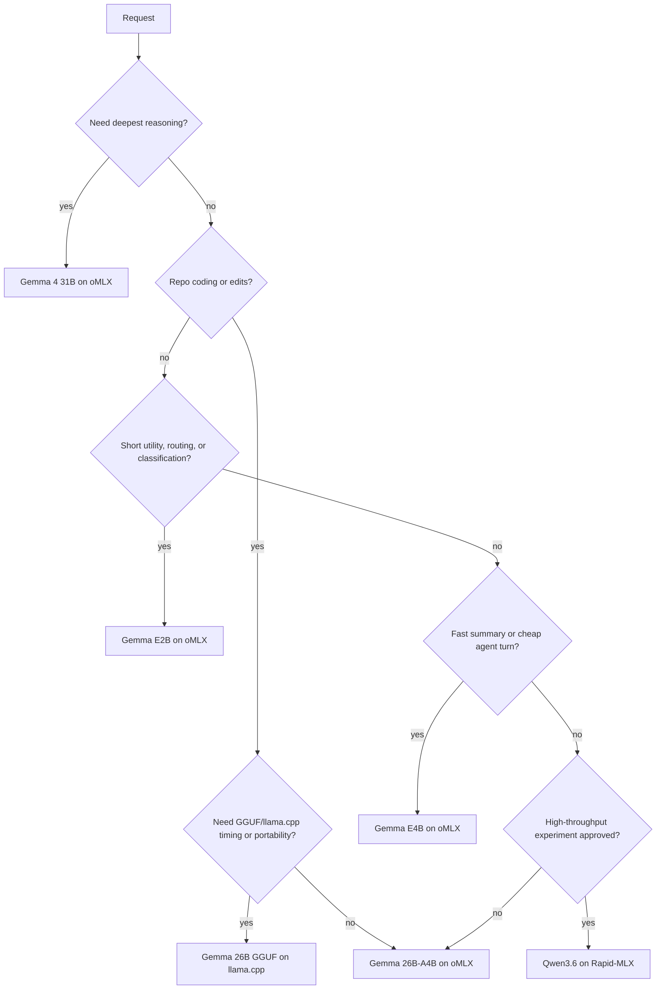

# Model Routing Decision Engine

Date: 2026-06-23

Machine-readable source: `config/local-ai-platform/routing-policy.json`.

## Decision Tree

## Routing Criteria

| Criterion | Route |
|---|---|
| Daily coding, docs, repo automation | Gemma 4 26B-A4B on oMLX |
| Hard architecture or root-cause synthesis | Gemma 4 31B on oMLX |
| Fast summaries, cheap helper turns | Gemma 4 E4B on oMLX |
| Classification, router pings, low-risk utility | Gemma 4 E2B on oMLX |
| Timing metadata, GGUF validation, long-context lab | Gemma 26B GGUF on llama.cpp |
| High-throughput or concurrency experiment | Qwen3.6 35B-A3B on Rapid-MLX |

## Failover

1. Production oMLX failure: validate health and `/v1/models`.
2. If oMLX is unhealthy, use llama.cpp GGUF coding lane for coding tasks.
3. If llama.cpp is unavailable, stop optional lab services and restore oMLX.
4. Rapid-MLX is not a production failover until long-duration stability passes.

## Promotion Criteria

A lane can move from lab to production only after:

- model catalog entry is complete;
- health script passes;
- 1h and 4h stability tests pass;
- Hermes one-shot passes when applicable;
- rollback is documented;
- secret handling is documented without raw values.
