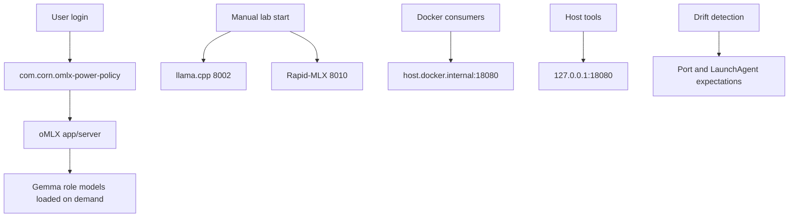

# Startup Orchestration V2

Date: 2026-06-23

## Automatic

| Component | Reason |
|---|---|
| `com.corn.omlx-power-policy` | Applies TTL/unload policy and keeps oMLX behavior predictable. |
| oMLX server | Stable production API front door. |
| DNSCrypt/AdGuard LaunchAgents | Required network infrastructure. |

## On Demand

| Component | Reason |
|---|---|
| llama.cpp on `8002` | Useful diagnostic/coding lane, but memory-expensive. |
| Rapid-MLX on `8010` | Experimental and previously warned about memory pressure. |
| OpenHands, OmniRoute, Octopoda dashboard | Broad access/routing surfaces; start per trial. |
| Large Gemma role models | Load only when used; unload after validation or benchmarks. |

## Removed From Startup

| Component | Decision |
|---|---|
| `com.corn.vllm-mlx` | Archived as obsolete. Missing binary and replaced by oMLX/manual lanes. |

## Guardrails

- `scripts/health/local-ai-health.py --skip-chat` is the default monitoring check.
- Full chat health checks are for validation, not frequent monitoring.
- `scripts/health/drift-detection/check-platform-drift.py` should run after startup, workflow, or endpoint changes.
