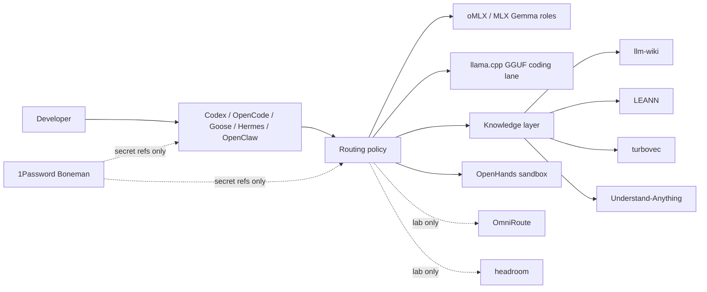
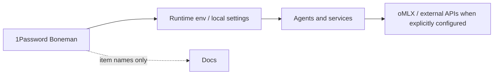

# Unified AI Platform Architecture

Date: 2026-06-22

## Current State

The prior star deployment installed the pieces but intentionally left risky services stopped. The live platform now has these layers:

| Layer | Current components | State |
|---|---|---|
| Model front door | oMLX/MLX at `127.0.0.1:18080` | Default local endpoint |
| GGUF lane | llama.cpp/llama-server at `127.0.0.1:8002` | Specialist coding benchmark lane |
| Developer agents | Codex, OpenCode, Goose, Hermes, OpenClaw | Installed; Codex/OpenCode have documented local wiring |
| Star-tool agents | OpenHands, Octopoda | Installed, stopped by default |
| Routing/proxy lab | OmniRoute, headroom | Installed, stopped by default |
| Knowledge/RAG | llm-wiki, LEANN, turbovec, Understand-Anything | Installed or wired; indexing is explicit |
| Apple Silicon tools | MLX, edge-lm, PonyExl3, SiliconScope | Installed for benchmark/eval work |
| Secrets | 1Password `Boneman` | Canonical vault |

## Target Architecture

The platform should behave as one local-AI system with explicit lanes:



## Integration Decisions

| Decision | Evidence | Result |
|---|---|---|
| Keep oMLX/MLX as the default model front door | Benchmark showed lower TTFT and it already carries the four-role Gemma contract. | Codex/OpenCode docs should prefer `127.0.0.1:18080/v1`. |
| Keep llama.cpp as the specialist GGUF lane | llama.cpp had better short coding decode throughput and richer timing metadata. | Use `127.0.0.1:8002/v1` for GGUF coding and production-simulation tests. |
| Do not default to Ollama | Ahmad methodology and local benchmarks favor MLX plus llama.cpp for this Mac. | Ollama remains compatibility/manual only. |
| Do not autostart OmniRoute/headroom/OpenHands/Octopoda | These can proxy credentials, manage provider routes, or mount workspaces. | Start with explicit scripts only. |
| Use `Boneman` as the only vault target | 1Password audit found `Boneman` populated and `Boneman Projects` empty. | All docs and new secret references point to `Boneman`. |

## Service Topology

| Service | Port/path | Owner | Start command | Default |
|---|---|---|---|---|
| oMLX | `http://127.0.0.1:18080/v1` | Host runtime | Existing host service | Expected running |
| llama.cpp | `http://127.0.0.1:8002/v1` | Host runtime | Existing local script/config | Optional |
| Octopoda | local dashboard/MCP | Star tools | `scripts/star-tools/start-octopoda-local.sh` | Stopped |
| OmniRoute | `127.0.0.1:20128` | Star tools | `scripts/star-tools/start-omniroute-local.sh` | Stopped |
| headroom | `127.0.0.1:8787` | Star tools | `scripts/star-tools/start-headroom-proxy.sh <upstream>` | Stopped |
| OpenHands | Docker Compose | Star tools | `scripts/star-tools/start-openhands-docker.sh` | Stopped |
| Understand dashboard | local web app | Star tools | `scripts/star-tools/start-understand-dashboard.sh` | Stopped |

## Dependency Map

- Codex depends on `~/.codex/config.toml` for plugin marketplace config and MCP definitions.
- OpenCode depends on `~/.config/opencode/opencode.json` for oMLX/GGUF providers and llm-wiki instruction wiring.
- OpenHands depends on Docker and the pulled `ghcr.io/openhands/agent-server:1.29.0-python` image.
- LEANN and Octopoda depend on uv tool environments under `~/.local/share/uv/tools`.
- edge-lm, PonyExl3, and turbovec depend on isolated uv environments under `~/.local/share/codex-star-tools/envs`.
- llm-wiki, OmniRoute, headroom, SiliconScope, and OpenHands source checkouts live under ignored `tmp/star-downloads`.

## Data Flow

1. Agent or IDE selects a lane from [model-routing.md](../architecture/model-routing.md).
2. Requests go directly to oMLX or llama.cpp unless a lab router is explicitly started.
3. Retrieval requests use llm-wiki, LEANN, turbovec, or Understand-Anything as context providers.
4. OpenHands runs only when a sandbox/workspace mount is intentional.
5. Secrets are resolved at runtime from environment, existing host settings, or 1Password `Boneman`; values are never written to docs.

## Secret Flow



`Boneman Projects` is an empty duplicate. Keep it unused and remove it manually only after confirming it remains empty.

## MCP Topology

See [mcp-topology.md](../architecture/mcp-topology.md) and `config/local-ai-platform/mcp-topology.json`.

## Agent Topology

- Codex: primary autonomous repo-maintenance agent; cloud fallback preserved.
- OpenCode: local coding shell with oMLX and GGUF providers configured.
- Goose, Hermes, OpenClaw: installed clients that should consume the same local endpoint policy when changed.
- OpenHands: sandboxed execution workbench; use for isolated high-agency tasks, not everyday host edits.
- Octopoda: local agent memory/audit layer; run per experiment.

## Model Topology

- Reasoning: Gemma 4 31B MLX through oMLX.
- Coding default: Gemma 4 26B A4B MLX through oMLX.
- Coding specialist: Gemma 4 26B A4B GGUF through llama.cpp.
- Fast agent: Gemma 4 E4B MLX through oMLX.
- Routing utility: Gemma 4 E2B MLX through oMLX.

## Validation

Run:

```bash
scripts/star-tools/platform-status.sh
scripts/star-tools/validate-star-deployments.sh
```

The status script is lightweight. The deployment validator performs deeper import/build/image checks.
