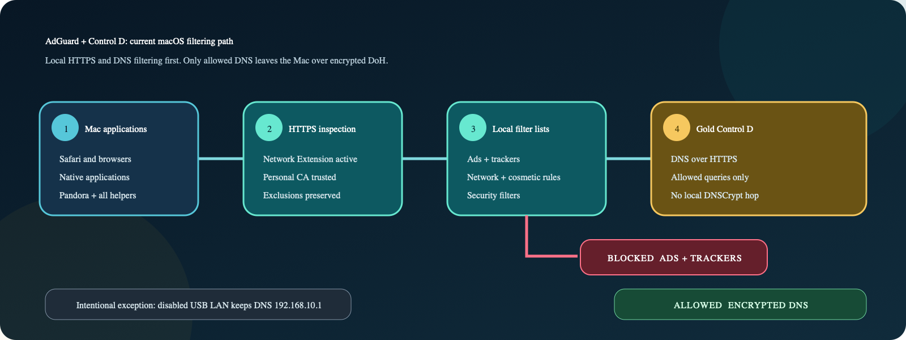
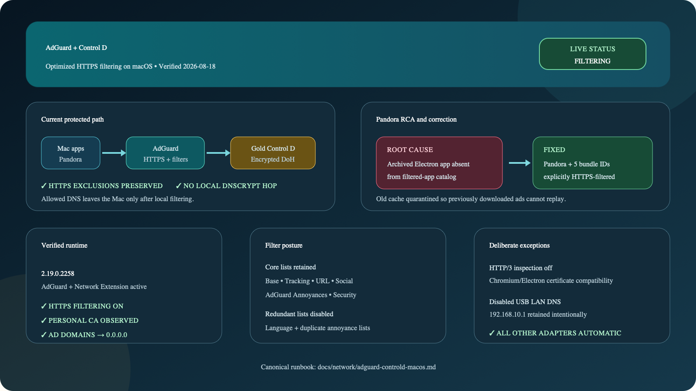

# AdGuard + Control D

The Mac's DNS filtering path is owned by AdGuard for Mac. AdGuard sends allowed
queries directly to the `Gold Controld` DNS-over-HTTPS provider:

```text
https://dns.controld.com/lcs1k6kfek
```

There is no local DNSCrypt service or loopback DNS upstream. The canonical
runbook is:

```text
/Users/corn/Documents/Boneman_Projects/docs/network/adguard-controld-macos.md
```



The mirrored visual set includes the editable
[Mermaid source](adguard-controld-flow.mmd), a
[scalable SVG flow](adguard-controld-flow.svg), and the
[HTTPS filtering infographic](adguard-controld-infographic.svg).

## Verified filtering posture

- AdGuard `2.19.0.2258` and its Network Extension are active.
- HTTPS filtering is enabled and AdGuard's HTTPS exclusions are preserved.
- Pandora and its Renderer, GPU, Plugin, and generic Electron helpers are
  explicitly included in the filtered-app catalog.
- Core AdGuard advertising, tracking, annoyance, and security filters remain
  enabled; redundant language and duplicate annoyance lists are disabled.
- HTTP/3 inspection remains off for Chromium/Electron certificate
  compatibility.
- All active network services use automatic DNS. The disabled
  `USB 10/100/1G/2.5G LAN` service intentionally retains `192.168.10.1`.
- The retired DNSCrypt service, listener, health check, and runbooks are no
  longer part of the supported architecture.

## Pandora correction

The archived Pandora Electron app was missing from AdGuard's application
catalog, so earlier ad media could be cached without HTTPS inspection. The app
and all helper bundle IDs are now explicitly filtered. The old cache was moved
to a recoverable local backup, and the clean session showed AdGuard's personal
CA with no downloaded Adswizz media.

This repository only owns Wi-Fi auto-switching. DNS configuration and
validation remain in `Boneman_Projects`.


